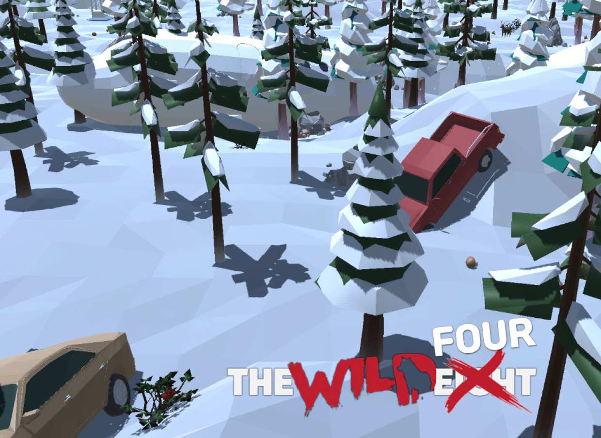

<h1 align="middle">The Wild Four</h1>
 
 

# 1. Project Overview (프로젝트 개요)
<h3>Unity 3D Team Project - The Wild Eight 모작</h3>
<h3>2024/07/08 ~ 2024/07/31 (3주)</h3>

 
 

# 2. Team Members (팀원 및 팀 소개)
| 전홍현 | 박지훈 | 김수진 | 김수주 |
|:---:|:---:|:---:|:---:|
|  |  |  |  |
|  |  |  |  |
| [GitHub](https://github.com/Yogurtsharbet) | [GitHub](https://github.com/enterpd20) | [GitHub](https://github.com/Nuuuing) | [GitHub](https://github.com/sjkim9717) |

 
 

# 3. Key Features (주요 기능)
## 3.1 System
  - 캐릭터 별 고유 특성
    - 스피드, 체력, 수집양 등
  - 생존요소
    - 추위, 허기, 체력 등
  - 제작
    - 도구, 음식, 의약품 등
  - 채집
    - 돌, 나무, 열매 등
  - 레벨 시스템
    - 거처, 작업대, 플레이어 스탯, 경험치 등
  - 상호작용
    - 각종 아이템, 동물, 맵 지형 등
  - 동물 AI
  - 아이템
    - 사용 효과, 처리 및 고유 상태
  

## 3.2 UI
  - 인게임 메뉴
  - 플레이어 인벤토리 및 거처, 작업장 인벤토리
  - 플레이어 장비
  - 상호작용
    - 아이템, 커서, 건설 여부 등
  - 미니맵

 

# 4. Technology Stack (기술 스택)
 

|  |  |  |
|:---:|:---:|:---:|
| Unity |  | 2020.3.36f1 |

 
 

